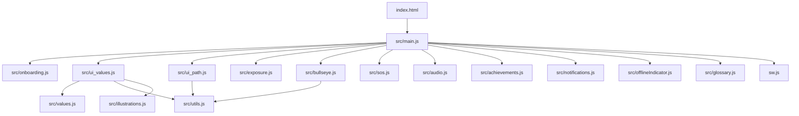

# Valores del Valle 🌲

**Valores del Valle** es una aplicación web progresiva (PWA) de autoexploración y crecimiento personal basada en los marcos teóricos de la **Terapia de Aceptación y Compromiso (ACT)** y la **Terapia Dialéctica Conductual (DBT)**. 

La aplicación funciona 100% offline, permitiendo al usuario explorar sus valores, evaluar sus áreas de vida clave, definir planes de acción y utilizar técnicas de regulación emocional en cualquier momento, sin necesidad de conexión a internet.

---

## 🌟 Módulos Principales

1. **Mazo de Valores (Exploración):**
   - Descubre e identifica qué es lo más importante en tu vida a través de un sistema interactivo de cartas ordenadas por áreas (Trabajo y Educación, Relaciones, Crecimiento Personal, Ocio).
   - Puedes buscar y filtrar cartas, además de crear tus propios valores personalizados.

2. **Top 10 (Ranking):**
   - Elige y ordena tus 10 valores principales mediante una interfaz interactiva y accesible que permite reordenar arrastrando (`≡`) o mediante botones direccionales (▲▼).

3. **La Diana (Evaluación):**
   - Evalúa tu grado de alineación actual (de 0 a 100) en las cuatro áreas de la vida mediante un gráfico de radar dinámico (Diana).
   - Guarda tu historial para observar tu evolución a lo largo del tiempo a través de un gráfico de línea integrado.

4. **El Sendero (Compromiso):**
   - Convierte tus valores en pasos pequeños y objetivos SMART (Específicos, Medibles, Alcanzables, Relevantes y con límite de Tiempo).
   - Identifica barreras internas (con sugerencia de habilidades de Mindfulness) y externas (con planes de acción concretos).
   - Añade recordatorios descargables en formato `.ics` para tu calendario.

5. **SOS (Regulación Emocional):**
   - Herramientas interactivas para situaciones de desborde emocional.
   - Técnicas paso a paso que incluyen respiración guiada (ejercicio de la caja), atención plena (5-4-3-2-1) y grounding físico (talones).

6. **Miedos y Exposición (Exposición basada en valores):**
   - Construye tu propia jerarquía de exposición vinculando cada situación temida con el valor que defiendes al enfrentarla, y ordénala por nivel de malestar anticipado (0-10).
   - Practica cada exposición en tres fases (preparación, durante y después) acompañado de metáforas de ACT ("El Forcejeo con el Monstruo", "Pasajeros en el Autobús") y recordatorios de defusión.
   - Registra tu progreso con el malestar antes/después y una reflexión enfocada en la acción según valores, no en la ausencia de ansiedad.

7. **Logros y Diccionario:**
   - Desbloquea logros interactivos a medida que progresas y accedes a un glosario integrado de conceptos clave.

---

## 🛠️ Arquitectura y Flujo de Módulos

La aplicación está construida con arquitectura modular en Javascript nativo moderno (ES modules) y utiliza `localStorage` para la persistencia local de los datos.



### Grafo de Dependencias Clave:
- **`src/dom.js`:** Concentra todas las referencias a los elementos del DOM en un diccionario reutilizable (`el`) para evitar consultas redundantes y mejorar el rendimiento de carga.
- **`src/utils.js`:** Proporciona funciones compartidas de base de datos (`LS`), gestores de mensajes dinámicos (`toast`) y modales premium asíncronos (`showPromptModal`, `showConfirmModal`).
- **`galaxy.js`:** Motor independiente que dibuja el fondo cósmico interactivo con Canvas en el fondo de la aplicación.
- **`sw.js`:** Service Worker responsable de la gestión de la caché y de garantizar el correcto funcionamiento de la PWA sin conexión.

---

## 📦 Despliegue Local y Ejecución

Al ser una aplicación estática y modular, puedes ejecutarla localmente de forma sencilla:

1. Clona el repositorio:
   ```bash
   git clone https://github.com/pataforista/valores.git
   ```
2. Inicia un servidor web local en el directorio del proyecto (los módulos ES6 requieren protocolo `http` o `https` y no se pueden ejecutar abriendo el archivo directamente como `file://`):
   - Con Python:
     ```bash
     python -m http.server 8000
     ```
   - Con Node.js (`http-server` o similar):
     ```bash
     npx http-server -p 8000
     ```
3. Abre en tu navegador:
   [http://localhost:8000](http://localhost:8000)

---

## ⚡ PWA y Modo Offline

- La aplicación instala un **Service Worker** (`sw.js`) que precachea todos los módulos Javascript, estilos CSS, tipografías y activos gráficos.
- Utiliza una estrategia **Network-First** para la navegación general, lo que asegura que si hay conexión se obtenga la última versión del código, y en su defecto recurra instantáneamente a la versión cacheada localmente.
- Los datos de usuario nunca se envían a servidores externos, garantizando privacidad absoluta (almacenamiento exclusivo en `localStorage` del dispositivo).

---

## 📄 Licencia

Este proyecto está bajo la Licencia MIT. Consulta el archivo `LICENSE` para más detalles.
